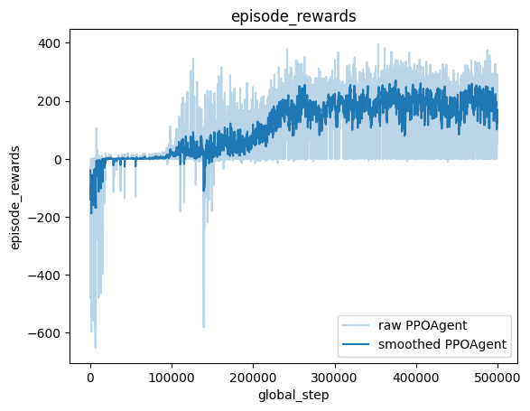
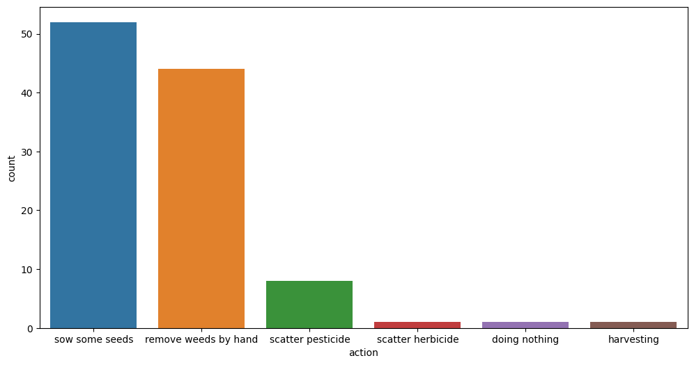

Code : PPO Agent
----------------

The following code can be find in the ``ppo_farm1.py`` in ``examples/``
folder.

Imports:
~~~~~~~~

.. code:: python

    from rlberry.agents.torch import PPOAgent
    from rlberry.manager import AgentManager, evaluate_agents, plot_writer_data
    from rlberry_farms import Farm1
    from rlberry.agents.torch.utils.training import model_factory_from_env
    import numpy as np
    import pandas as pd
    import seaborn as sns

Settings :
~~~~~~~~~~

We’ll use the ``Farm1`` environment

.. code:: python

    env_ctor, env_kwargs = Farm1, {}

We use an architecture of :math:`256\times 256` for both the value and
policy neural network of ppo. Remark : to enable tensorboard on the farm
(to see the internal variable of the farm that are not visible to the
agent), we could have used

.. code:: python

   env_ctor, env_kwargs = Farm1,{"enable_tensorboard": True, "output_dir": "ppo1_results"}

.. code:: python

    
    policy_configs = {
        "type": "MultiLayerPerceptron",  # A network architecture
        "layer_sizes": (256, 256),  # Network dimensions
        "reshape": False,
        "is_policy": True,
    }
    
    value_configs = {
        "type": "MultiLayerPerceptron",
        "layer_sizes": (256, 256),
        "reshape": False,
        "out_size": 1,
    }

Agent code:
~~~~~~~~~~~

We use rlberry’s
`PPOAgent <https://rlberry.readthedocs.io/en/latest/generated/rlberry.agents.torch.PPOAgent.html#rlberry.agents.torch.PPOAgent>`__.
Remark that 365 days is the maximum lenght of an episode. This helps us
to fix some of the parameters.

.. code::  python

    manager = AgentManager(
            PPOAgent,
            (env_ctor, env_kwargs),
            agent_name="PPOAgent",
            init_kwargs=dict(
                policy_net_fn=model_factory_from_env,
                policy_net_kwargs=policy_configs,
                value_net_fn=model_factory_from_env,
                value_net_kwargs=value_configs,
                learning_rate=9e-5,
                n_steps=5 * 365,
                batch_size=365,
                eps_clip=0.2,
            ),
            fit_budget=5e5,
            eval_kwargs=dict(eval_horizon=365),
            n_fit=1,
            output_dir="ppo1_results", # results/trained agents are kept in this directory
        )
    manager.fit()

.. parsed-literal::

    NFO] 15:03: Running AgentManager fit() for PPOAgent with n_fit = 1 and max_workers = None. 
    NFO] 15:03: [PPOAgent[worker: 0]] | max_global_step = 1971 | episode_rewards = -104.0 | total_episodes = 22 | fit/surrogate_loss = -19.57242202758789 | fit/entropy_loss = 1.2079650163650513 |  
       ...
    NFO] 15:17: [PPOAgent[worker: 0]] | max_global_step = 497861 | episode_rewards = 230.34420630570588 | total_episodes = 5421 | fit/surrogate_loss = -7.933042526245117 | fit/entropy_loss = 0.6365718245506287 |  
    NFO] 15:17: [PPOAgent[worker: 0]] | max_global_step = 499651 | episode_rewards = 291.2316735442703 | total_episodes = 5436 | fit/surrogate_loss = 5.556310653686523 | fit/entropy_loss = 0.6349660158157349 |  
    NFO] 15:18: ... trained! 
    

Training reward curve
~~~~~~~~~~~~~~~~~~~~~

.. code:: python

    data = plot_writer_data(manager, tag="episode_rewards", smooth_weight=0.8) # smoothing tensorboard-style

Evaluation of the trained agent
~~~~~~~~~~~~~~~~~~~~~~~~~~~~~~~

.. code:: python

    evaluation = evaluate_agents([manager], n_simulations=128, plot=False)
    evaluation.describe()

.. parsed-literal::

    [INFO] 15:22: Evaluating PPOAgent... 
    [INFO] Evaluation:................................................................................................................................  Evaluation finished 

.. raw:: html

    

    
    <table border="1" class="dataframe">
      <thead>
        <tr style="text-align: right;">
          <th></th>
          <th>PPOAgent</th>
        </tr>
      </thead>
      <tbody>
        <tr>
          <th>count</th>
          <td>128.000000</td>
        </tr>
        <tr>
          <th>mean</th>
          <td>167.533772</td>
        </tr>
        <tr>
          <th>std</th>
          <td>31.468684</td>
        </tr>
        <tr>
          <th>min</th>
          <td>89.150279</td>
        </tr>
        <tr>
          <th>25%</th>
          <td>147.731616</td>
        </tr>
        <tr>
          <th>50%</th>
          <td>170.626595</td>
        </tr>
        <tr>
          <th>75%</th>
          <td>188.514045</td>
        </tr>
        <tr>
          <th>max</th>
          <td>254.114489</td>
        </tr>
      </tbody>
    </table>
    

Small peek into the agents policy
~~~~~~~~~~~~~~~~~~~~~~~~~~~~~~~~~

.. code:: python

    agent = manager.agent_handlers[0] # select the agent from the manager

.. code:: python

    env = Farm1()
    obs = env.reset()
    
    actions_txt = ["doing nothing", 
               "1L of water", 
               "5L of water", 
               "harvesting",
               "sow some seeds",
               "scatter fertilizer",
               "scatter herbicide",
               "scatter pesticide",
               "remove weeds by hand",]
    episode = pd.DataFrame()
    for day in range(365):
        action = agent.policy(obs)    
        print("Day: {}, Mean temp: {}, stage: {}, weight of  fruit: {}".format(obs[0], np.round(obs[1],3), 
                                                                               int(obs[7]), obs[15]))
        obs,reward, is_done,_ =  env.step(action)
        print("Action is", actions_txt[action])
        episode = pd.concat([episode, pd.DataFrame({'action':[actions_txt[action]],
                                                    'reward':[reward]})], ignore_index=True)
        print('')
        if is_done:
            print('Plant is Dead')
            break

.. parsed-literal::

    Day: 1.0, Mean temp: 4.939, stage: 0, weight of  fruit: 0.0
    Action is sow some seeds
    
    Day: 2.0, Mean temp: 7.94, stage: 1, weight of  fruit: 0.0
    Action is sow some seeds
    
    Day: 3.0, Mean temp: 4.929, stage: 1, weight of  fruit: 0.0
    Action is sow some seeds
    
    Day: 4.0, Mean temp: 6.415, stage: 1, weight of  fruit: 0.0
    Action is sow some seeds
    
    Day: 5.0, Mean temp: 5.47, stage: 1, weight of  fruit: 0.0
    Action is sow some seeds
    
    Day: 6.0, Mean temp: 6.813, stage: 1, weight of  fruit: 0.0
    Action is sow some seeds
    
    Day: 7.0, Mean temp: 11.389, stage: 1, weight of  fruit: 0.0
    Action is sow some seeds
    
    Day: 8.0, Mean temp: 11.926, stage: 1, weight of  fruit: 0.0
    Action is sow some seeds
    
    Day: 9.0, Mean temp: 6.926, stage: 1, weight of  fruit: 0.0
    Action is sow some seeds
    
    Day: 10.0, Mean temp: 5.888, stage: 1, weight of  fruit: 0.0
    Action is sow some seeds
    
    Day: 11.0, Mean temp: 7.129, stage: 1, weight of  fruit: 0.0
    Action is sow some seeds
    
    Day: 12.0, Mean temp: 7.57, stage: 1, weight of  fruit: 0.0
    Action is sow some seeds
    
    Day: 13.0, Mean temp: 10.345, stage: 1, weight of  fruit: 0.0
    Action is sow some seeds
    
    Day: 14.0, Mean temp: 8.187, stage: 1, weight of  fruit: 0.0
    Action is sow some seeds
    
    Day: 15.0, Mean temp: 7.181, stage: 1, weight of  fruit: 0.0
    Action is remove weeds by hand
    
    Day: 16.0, Mean temp: 8.054, stage: 1, weight of  fruit: 0.0
    Action is remove weeds by hand
    
    Day: 17.0, Mean temp: 3.66, stage: 1, weight of  fruit: 0.0
    Action is sow some seeds
    
    Day: 18.0, Mean temp: 3.519, stage: 1, weight of  fruit: 0.0
    Action is remove weeds by hand
    
    Day: 19.0, Mean temp: 1.83, stage: 1, weight of  fruit: 0.0
    Action is remove weeds by hand
    
    Day: 20.0, Mean temp: -0.517, stage: 1, weight of  fruit: 0.0
    Action is remove weeds by hand
    
    Day: 21.0, Mean temp: 1.404, stage: 1, weight of  fruit: 0.0
    Action is remove weeds by hand
    
    Day: 22.0, Mean temp: 3.012, stage: 1, weight of  fruit: 0.0
    Action is remove weeds by hand
    
    Day: 23.0, Mean temp: 1.025, stage: 1, weight of  fruit: 0.0
    Action is remove weeds by hand
    
    Day: 24.0, Mean temp: 1.941, stage: 1, weight of  fruit: 0.0
    Action is sow some seeds
    
    Day: 25.0, Mean temp: 5.794, stage: 1, weight of  fruit: 0.0
    Action is remove weeds by hand
    
    Day: 26.0, Mean temp: 8.072, stage: 1, weight of  fruit: 0.0
    Action is sow some seeds
    
    Day: 27.0, Mean temp: 4.948, stage: 1, weight of  fruit: 0.0
    Action is remove weeds by hand
    
    Day: 28.0, Mean temp: 5.181, stage: 1, weight of  fruit: 0.0
    Action is remove weeds by hand
    
    Day: 29.0, Mean temp: 7.735, stage: 1, weight of  fruit: 0.0
    Action is sow some seeds
    
    Day: 30.0, Mean temp: 11.217, stage: 1, weight of  fruit: 0.0
    Action is sow some seeds
    
    Day: 31.0, Mean temp: 10.809, stage: 1, weight of  fruit: 0.0
    Action is remove weeds by hand
    
    Day: 32.0, Mean temp: 10.371, stage: 1, weight of  fruit: 0.0
    Action is sow some seeds
    
    Day: 33.0, Mean temp: 9.683, stage: 1, weight of  fruit: 0.0
    Action is sow some seeds
    
    Day: 34.0, Mean temp: 6.318, stage: 1, weight of  fruit: 0.0
    Action is remove weeds by hand
    
    Day: 35.0, Mean temp: 6.459, stage: 1, weight of  fruit: 0.0
    Action is remove weeds by hand
    
    Day: 36.0, Mean temp: 4.223, stage: 1, weight of  fruit: 0.0
    Action is sow some seeds
    
    Day: 37.0, Mean temp: 4.762, stage: 1, weight of  fruit: 0.0
    Action is remove weeds by hand
    
    Day: 38.0, Mean temp: 8.315, stage: 1, weight of  fruit: 0.0
    Action is sow some seeds
    
    Day: 39.0, Mean temp: 10.0, stage: 1, weight of  fruit: 0.0
    Action is remove weeds by hand
    
    Day: 40.0, Mean temp: 7.975, stage: 1, weight of  fruit: 0.0
    Action is sow some seeds
    
    Day: 41.0, Mean temp: 6.469, stage: 1, weight of  fruit: 0.0
    Action is sow some seeds
    
    Day: 42.0, Mean temp: 5.657, stage: 1, weight of  fruit: 0.0
    Action is sow some seeds
    
    Day: 43.0, Mean temp: 7.101, stage: 1, weight of  fruit: 0.0
    Action is remove weeds by hand
    
    Day: 44.0, Mean temp: 7.822, stage: 1, weight of  fruit: 0.0
    Action is remove weeds by hand
    
    Day: 45.0, Mean temp: 10.494, stage: 1, weight of  fruit: 0.0
    Action is sow some seeds
    
    Day: 46.0, Mean temp: 12.004, stage: 1, weight of  fruit: 0.0
    Action is sow some seeds
    
    Day: 47.0, Mean temp: 7.691, stage: 1, weight of  fruit: 0.0
    Action is remove weeds by hand
    
    Day: 48.0, Mean temp: 7.115, stage: 1, weight of  fruit: 0.0
    Action is sow some seeds
    
    Day: 49.0, Mean temp: 6.424, stage: 1, weight of  fruit: 0.0
    Action is remove weeds by hand
    
    Day: 50.0, Mean temp: 7.989, stage: 1, weight of  fruit: 0.0
    Action is sow some seeds
    
    Day: 51.0, Mean temp: 6.257, stage: 1, weight of  fruit: 0.0
    Action is remove weeds by hand
    
    Day: 52.0, Mean temp: 8.572, stage: 1, weight of  fruit: 0.0
    Action is remove weeds by hand
    
    Day: 53.0, Mean temp: 10.569, stage: 1, weight of  fruit: 0.0
    Action is sow some seeds
    
    Day: 54.0, Mean temp: 9.151, stage: 1, weight of  fruit: 0.0
    Action is remove weeds by hand
    
    Day: 55.0, Mean temp: 6.71, stage: 1, weight of  fruit: 0.0
    Action is sow some seeds
    
    Day: 56.0, Mean temp: 4.177, stage: 1, weight of  fruit: 0.0
    Action is remove weeds by hand
    
    Day: 57.0, Mean temp: 2.82, stage: 1, weight of  fruit: 0.0
    Action is remove weeds by hand
    
    Day: 58.0, Mean temp: 4.293, stage: 1, weight of  fruit: 0.0
    Action is sow some seeds
    
    Day: 59.0, Mean temp: 8.099, stage: 1, weight of  fruit: 0.0
    Action is sow some seeds
    
    Day: 60.0, Mean temp: 6.137, stage: 1, weight of  fruit: 0.0
    Action is sow some seeds
    
    Day: 61.0, Mean temp: 5.656, stage: 1, weight of  fruit: 0.0
    Action is sow some seeds
    
    Day: 62.0, Mean temp: 4.834, stage: 1, weight of  fruit: 0.0
    Action is remove weeds by hand
    
    Day: 63.0, Mean temp: 5.631, stage: 1, weight of  fruit: 0.0
    Action is remove weeds by hand
    
    Day: 64.0, Mean temp: 7.187, stage: 1, weight of  fruit: 0.0
    Action is sow some seeds
    
    Day: 65.0, Mean temp: 6.208, stage: 1, weight of  fruit: 0.0
    Action is sow some seeds
    
    Day: 66.0, Mean temp: 6.336, stage: 1, weight of  fruit: 0.0
    Action is remove weeds by hand
    
    Day: 67.0, Mean temp: 8.534, stage: 1, weight of  fruit: 0.0
    Action is sow some seeds
    
    Day: 68.0, Mean temp: 7.833, stage: 1, weight of  fruit: 0.0
    Action is sow some seeds
    
    Day: 69.0, Mean temp: 11.172, stage: 1, weight of  fruit: 0.0
    Action is sow some seeds
    
    Day: 70.0, Mean temp: 12.419, stage: 1, weight of  fruit: 0.0
    Action is sow some seeds
    
    Day: 71.0, Mean temp: 8.701, stage: 1, weight of  fruit: 0.0
    Action is sow some seeds
    
    Day: 72.0, Mean temp: 7.703, stage: 1, weight of  fruit: 0.0
    Action is sow some seeds
    
    Day: 73.0, Mean temp: 7.387, stage: 1, weight of  fruit: 0.0
    Action is sow some seeds
    
    Day: 74.0, Mean temp: 9.623, stage: 1, weight of  fruit: 0.0
    Action is remove weeds by hand
    
    Day: 75.0, Mean temp: 7.773, stage: 1, weight of  fruit: 0.0
    Action is sow some seeds
    
    Day: 76.0, Mean temp: 7.791, stage: 1, weight of  fruit: 0.0
    Action is remove weeds by hand
    
    Day: 77.0, Mean temp: 10.03, stage: 2, weight of  fruit: 0.0
    Action is remove weeds by hand
    
    Day: 78.0, Mean temp: 9.424, stage: 3, weight of  fruit: 0.0
    Action is remove weeds by hand
    
    Day: 79.0, Mean temp: 7.026, stage: 3, weight of  fruit: 0.0
    Action is remove weeds by hand
    
    Day: 80.0, Mean temp: 6.534, stage: 3, weight of  fruit: 0.0
    Action is remove weeds by hand
    
    Day: 81.0, Mean temp: 6.065, stage: 3, weight of  fruit: 0.0
    Action is sow some seeds
    
    Day: 82.0, Mean temp: 5.533, stage: 3, weight of  fruit: 0.0
    Action is remove weeds by hand
    
    Day: 83.0, Mean temp: 6.214, stage: 3, weight of  fruit: 0.0
    Action is remove weeds by hand
    
    Day: 84.0, Mean temp: 6.555, stage: 3, weight of  fruit: 0.0
    Action is remove weeds by hand
    
    Day: 85.0, Mean temp: 6.661, stage: 3, weight of  fruit: 0.0
    Action is remove weeds by hand
    
    Day: 86.0, Mean temp: 7.827, stage: 3, weight of  fruit: 0.0
    Action is remove weeds by hand
    
    Day: 87.0, Mean temp: 8.425, stage: 3, weight of  fruit: 0.0
    Action is remove weeds by hand
    
    Day: 88.0, Mean temp: 4.653, stage: 3, weight of  fruit: 0.0
    Action is sow some seeds
    
    Day: 89.0, Mean temp: 4.759, stage: 3, weight of  fruit: 0.0
    Action is remove weeds by hand
    
    Day: 90.0, Mean temp: 5.607, stage: 3, weight of  fruit: 0.0
    Action is scatter pesticide
    
    Day: 91.0, Mean temp: 5.649, stage: 3, weight of  fruit: 0.0
    Action is scatter pesticide
    
    Day: 92.0, Mean temp: 7.239, stage: 3, weight of  fruit: 0.0
    Action is scatter pesticide
    
    Day: 93.0, Mean temp: 8.958, stage: 3, weight of  fruit: 0.0
    Action is sow some seeds
    
    Day: 94.0, Mean temp: 10.47, stage: 3, weight of  fruit: 0.0
    Action is scatter pesticide
    
    Day: 95.0, Mean temp: 13.273, stage: 4, weight of  fruit: 0.0
    Action is scatter pesticide
    
    Day: 96.0, Mean temp: 12.435, stage: 5, weight of  fruit: 0.0
    Action is scatter pesticide
    
    Day: 97.0, Mean temp: 13.612, stage: 5, weight of  fruit: 0.0
    Action is sow some seeds
    
    Day: 98.0, Mean temp: 17.644, stage: 5, weight of  fruit: 0.0
    Action is remove weeds by hand
    
    Day: 99.0, Mean temp: 16.656, stage: 5, weight of  fruit: 0.0
    Action is sow some seeds
    
    Day: 100.0, Mean temp: 16.323, stage: 5, weight of  fruit: 0.0
    Action is scatter pesticide
    
    Day: 101.0, Mean temp: 16.201, stage: 6, weight of  fruit: 0.0
    Action is remove weeds by hand
    
    Day: 102.0, Mean temp: 16.371, stage: 6, weight of  fruit: 1.0
    Action is remove weeds by hand
    
    Day: 103.0, Mean temp: 9.322, stage: 6, weight of  fruit: 1.0
    Action is scatter pesticide
    
    Day: 104.0, Mean temp: 6.921, stage: 6, weight of  fruit: 1.1478078665013505
    Action is scatter herbicide
    
    Day: 105.0, Mean temp: 11.057, stage: 6, weight of  fruit: 1.438188881833974
    Action is sow some seeds
    
    Day: 106.0, Mean temp: 15.125, stage: 6, weight of  fruit: 2.598126293698175
    Action is doing nothing
    
    Day: 107.0, Mean temp: 15.147, stage: 6, weight of  fruit: 4.149379697634327
    Action is harvesting
    
    Plant is Dead

.. code:: python

    import seaborn as sns
    fig, ax = plt.subplots(figsize=(12,6))
    sns.countplot(data = episode, x = "action")

